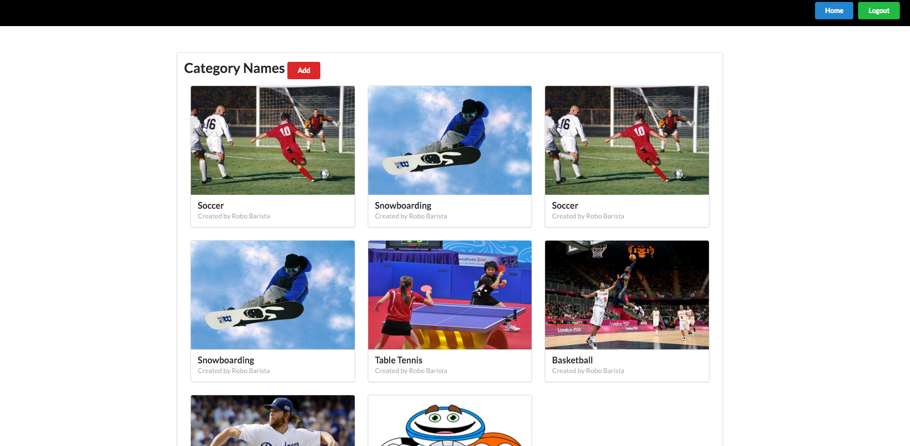
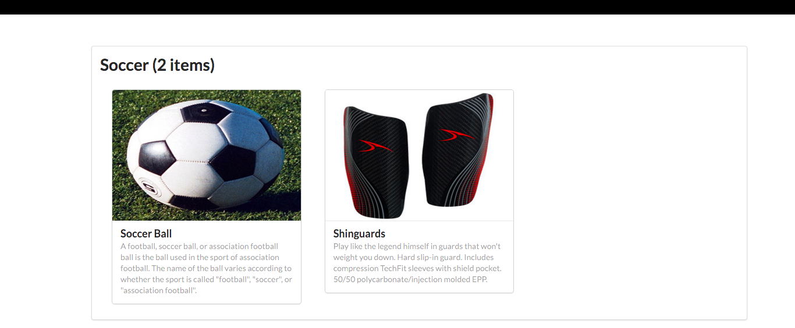

# Sporting Items Catalog App
Built using Vagrant and Flask-SQLAlchemy. Allows for FB and G+ account logins.

# Screenshots

# Instructions

## Run the virtual machine!

Using the terminal, change directory to oauth (**cd oauth**), then type **vagrant up** to launch your virtual machine.

## Running the Sporting Items Catalog App
Once it is up and running, type **vagrant ssh**. This will log your terminal into the virtual machine, and you'll get a Linux shell prompt. When you want to log out, type **exit** at the shell prompt.  To turn the virtual machine off (without deleting anything), type **vagrant halt**. If you do this, you'll need to run **vagrant up** again before you can log into it.

Now that you have Vagrant up and running type **vagrant ssh** to log into your VM.  change to the /vagrant directory by typing **cd /vagrant**. This will take you to the shared folder between your virtual machine and host machine.

Type **ls** to ensure that you are inside the directory that contains project.py, database_setup.py, and two directories named 'templates' and 'static'

Now type **python database_setup.py** to initialize the database.

Type **python load_db.py** to populate the database with restaurants and menu items. (Optional)

Type **python project.py** to run the Flask web server. In your browser visit **http://localhost:5000** to view the restaurant menu app.  You should be able to view, add, edit, and delete menu items and restaurants.
